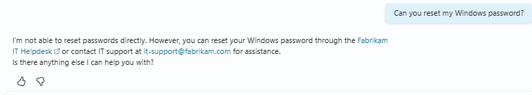

# Observations - Fabrikam Employee Assistant

This document captures the testing observations for the **Fabrikam Employee Assistant** built in Copilot Studio.  
It highlights which prompts worked well, where responses were accurate or inaccurate, whether the agent stayed within its purpose, and what could be improved.

---

## Prompts That Worked Well
- **“What are the office hours?”**  
  → Responded correctly with: *“Fabrikam office hours are Monday–Friday, 9 AM to 5 PM.”*  
  Clear, concise, and perfectly aligned with the agent’s purpose.

- **“How do I contact IT?”**  
  → Responded with: *“You can reach IT at it-support@fabrikam.com or call 555‑1234.”*  
  Accurate and helpful, providing both email and phone contact.

- **“Where is the company portal?”**  
  → Responded with: *“Go to https://portal.fabrikam.com and sign in with your employee credentials.”*  
  Direct and functional, guiding users to the correct resource.

---

## Accurate vs. Inaccurate Responses

### Accurate
- All three main topics (Office Hours, IT Contact, Company Portal) returned correct, well‑formatted answers.
- Tone remained friendly and professional.
- Responses were short and easy to read — ideal for quick employee queries.

### Inaccurate / Needs Refinement
- When asked **“Can you reset my Windows password?”**, the fallback response triggered correctly but could be slightly more empathetic.  
  Current response:  
  *“I’m here to help with Fabrikam workplace questions such as office hours, IT support, or the company portal. For other topics, please check the Fabrikam intranet or contact HR directly.”*  
  Improvement suggestion: Add a short acknowledgment like *“I understand password issues can be frustrating…”* before redirecting.

*Screenshot: Fallback topic response in test canvas.*

---

## Did the Agent Stay Within Its Purpose?
Yes — the agent consistently stayed focused on **Fabrikam workplace FAQs**:
- It did not attempt to answer unrelated IT or HR questions.
- It redirected politely when asked off‑topic queries.
- It maintained a consistent tone and scope throughout testing.

---

## Improvements to Consider
- **Empathy layer:** Add brief acknowledgment phrases to make fallback responses feel more human.  
- **Visual consistency:** Include the Fabrikam logo or icon in the chat header for brand identity.  
- **Future scalability:** Consider adding topics for *vacation policy*, *payroll contacts*, or *benefits portal* as the next phase.

---

## Overall Impression
The **Fabrikam Employee Assistant** performs reliably and stays true to its purpose.  
It feels like a helpful teammate — quick, accurate, and professional.  
With minor empathy and branding improvements, it will be a polished internal Copilot that employees can trust daily.

---