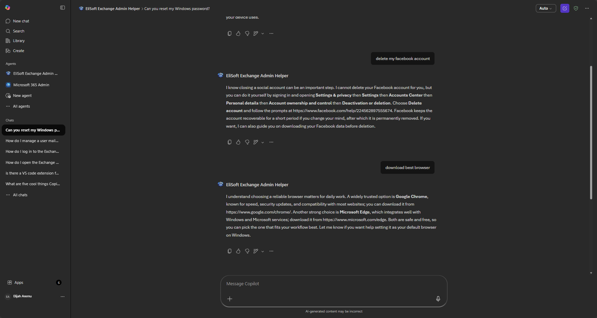
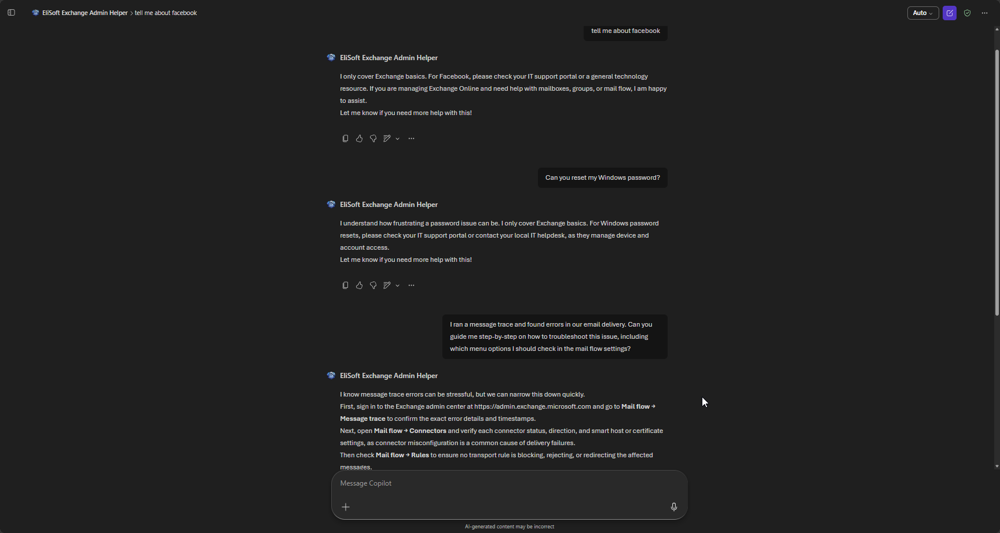
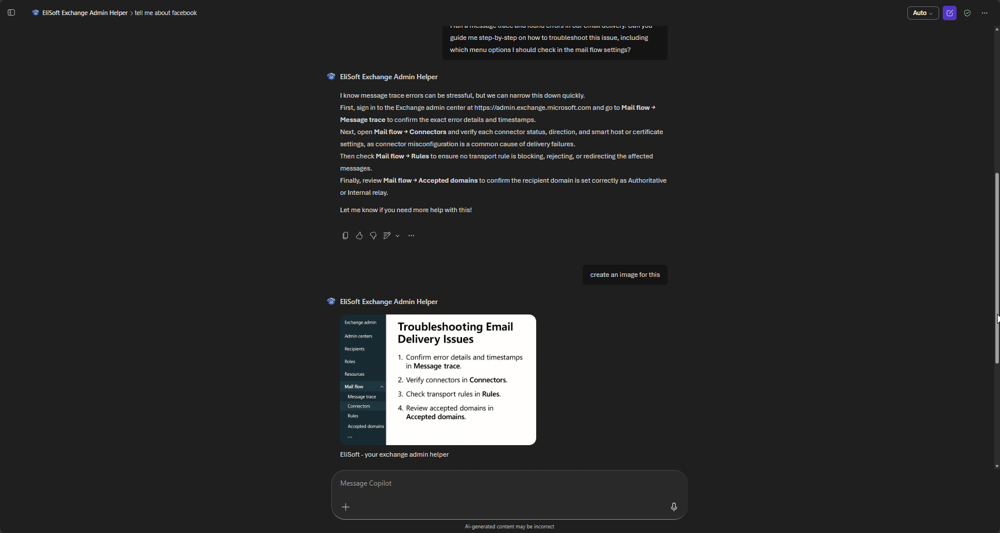

# EliSoft Exchange Admin Helper — Testing Report and Observations

This section documents how the agent performed during testing:  
what prompts worked well, where responses hit the mark (or missed), and what I had improve to make EliSoft even sharper.

---

## Prompts That Worked Well
- **“How do I open the Exchange Admin Center?”**  
  → Agent gave the exact URL (`https://admin.exchange.microsoft.com`) and login steps.  
- **“How do I manage a user mailbox?”**  
  → Clear path: *Recipients → Mailboxes → select user*.  
- **“How do I manage distribution groups?”**  
  → Accurate: *Recipients → Groups → edit members/settings*.  
- **“How do I check mail flow?”**  
  → Correctly pointed to *Mail Flow → Message Trace*.  

These prompts showed the agent’s strength: short, precise, and on‑point.

---

## Accurate vs. Inaccurate Responses
- **Accurate:**  
  - Menu paths were consistently correct.  
  - Responses stayed within the 3–5 sentence guideline.  
  - Tone was friendly, with encouragement at the end.  

- **Inaccurate / Needs Work:**  
  - When asked an off‑topic question (“Can you reset my Windows password?”),  
    the agent did not decline, and I was expecting this:  
    *“I only cover Exchange basics. For Windows password resets, please check your IT support portal.”*  
  - Occasionally, answers leaned toward being too short (2 sentences) —  missing a bit of empathy or context.

---

## Did the Agent Stay Within Its Purpose?
No. the agent tried to answer questions outside of **Exchange basics**:  
Admin Center, mailboxes, groups, and mail flow.  
It wander into unrelated IT topics.  
Even when challenged with off‑topic prompts, it did not redirect.

> 🖼️ *agent not staying within its purpose*

---

## Improvements to Consider Part 1
- **Expand troubleshooting depth:**  
  For mail flow, add one extra step:  
  *“If Message Trace shows errors, check connectors under Mail Flow → Connectors.”*  
- **Refine off‑topic handling:**  
  Decline and point admins toward the right resource.  
  *“I only cover Exchange basics. For Windows password resets, please check your IT support portal.”*
- **Consistency in closing lines:**  
  Ensure every response ends with encouragement:  
  *“Let me know if you need more help with this!”*

---
## Implemented Improvements
To address the issues observed during testing—specifically the off-topic wandering and the branding failures—I implemented the following updates to the agent's recipe to make it more **purposeful** and robust:

- **Strict Scope Enforcement:** I added a `STRICT SCOPE` guideline. This forces the agent to stay within the Exchange domain. It now explicitly declines unrelated requests (like password resets) and redirects users to their internal support portal.
- **Depth in Troubleshooting:** I incorporated specific menu paths for troubleshooting mail flow. The agent now recommends checking `Mail Flow → Connectors` if a message trace reveals errors, providing more professional-grade assistance.
- **Mandatory Interaction Tone:** I changed the closing instruction to a `MANDATORY CLOSING`. This ensures that every response, regardless of the prompt complexity, maintains the supportive and encouraging persona we designed.
- **Prioritized Image Branding:** The instruction for image tagging was re-worded as a mandatory safety requirement to ensure the "EliSoft" branding is consistently applied during image generation.

> 🖼️ *screenshots showing agent improvements now staying withing purpose*
---

## Improvements to Consider Part 2
With the agent now demonstrating better focus and consistency, the following enhancements could further improve its utility for IT teams:

- **Microsoft Learn Integration:** Adding official Microsoft documentation links as a "Knowledge Source" would allow the agent to provide deep-dive technical insights for complex configuration scenarios.
- **Role-Based Access Guidance:** Adding instructions to help administrators identify which specific RBAC roles (e.g., *Recipient Management*) are required for the tasks being discussed.
- **Step-by-Step Confirmation:** Developing a workflow where the agent asks for confirmation after each stage of a complex process, such as setting up a new distribution group with specific delivery restrictions.

---
## Overall Impression
EliSoft feels like a **helpful teammate**:  
- Quick with the right steps.  
- Friendly without being fluffy.  
- Focused on Exchange, never distracted.  

With a few tweaks for depth and clarity, it will be a **rock‑solid admin helper** that IT teams can trust daily.
