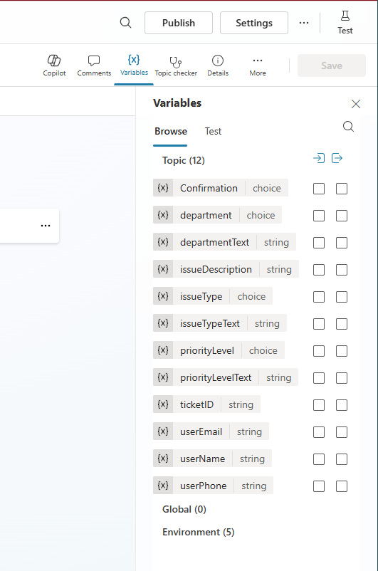
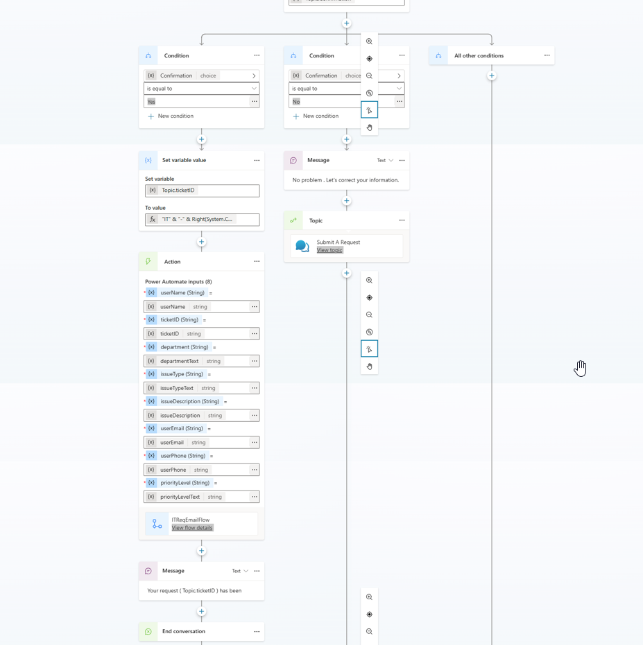
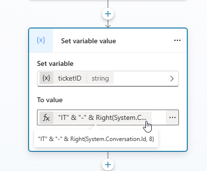
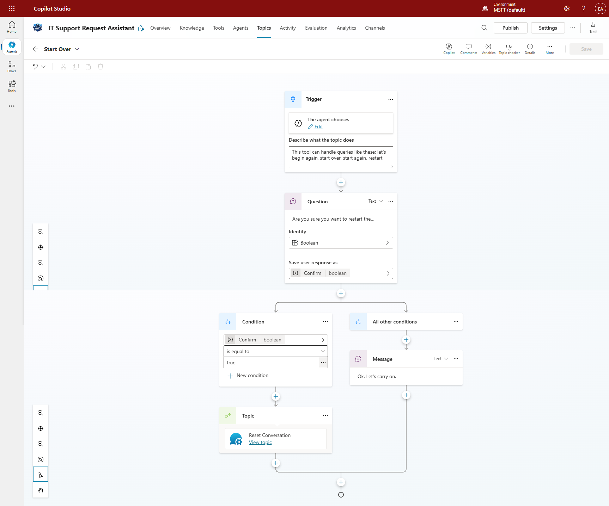
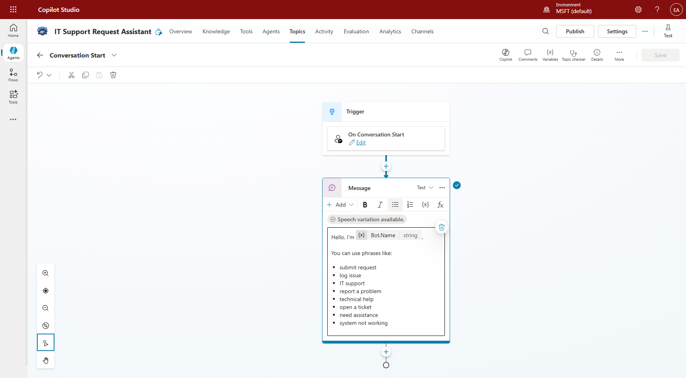
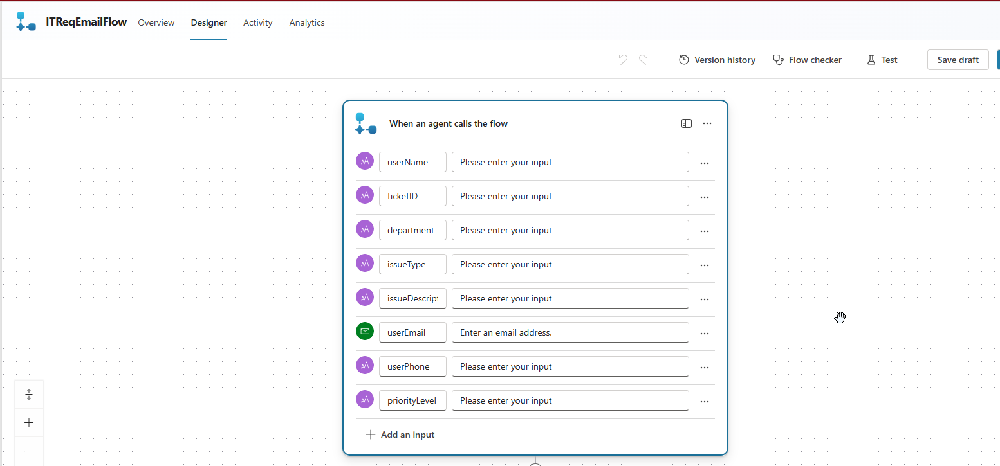
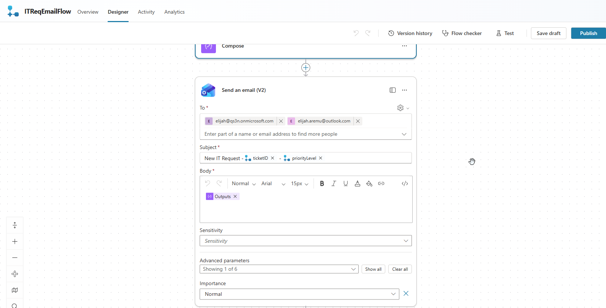
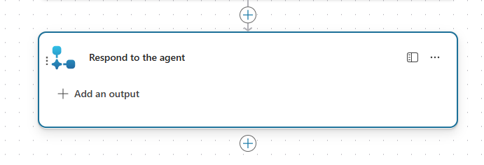

# Configuration and Technical Setup

## Tools and Technologies

The solution was built using:
- Microsoft Copilot Studio
- Power Automate
- Outlook (email integration)

## Copilot Studio Configuration

### Variable Inventory (Implementation)

#### Copilot Studio Variables

| Variable | Type | Purpose |
| --- | --- | --- |
| userName | String | Stores user name |
| department | Choice | User department selection |
| departmentText | String | Normalized department text |
| issueType | Choice | User issue type selection |
| issueTypeText | String | Normalized issue type text |
| priorityLevel | Choice | User priority selection |
| priorityText | String | Normalized priority text |
| issueDescription | String | Issue details entered by user |
| userEmail | String | Requester email captured for notifications |
| userPhone | String | Requester phone captured for support follow-up |
| ticketID | String | Generated ticket identifier |
| Confirm | Boolean | Restart confirmation in Start Over topic |

#### System/Context Variables Used

| Variable | Type | Purpose |
| --- | --- | --- |
| System.Conversation.Id | System | Source value for generating ticket ID |
| Bot.Name | System | Displayed in Conversation Start welcome message |

#### Power Automate Flow Inputs

| Input | Type | Purpose |
| --- | --- | --- |
| userName | Text | Requester name |
| department | Text | Department value passed to flow |
| issueType | Text | Issue category passed to flow |
| issueDescription | Text | Issue detail payload |
| priorityLevel | Text | Priority value passed to flow |
| ticketID | Text | Generated ticket number |
| userEmail | Email/Text | Requester email used in notification context |
| userPhone | Text | Requester phone used in support follow-up context |

### Topic: Submit a Request

#### Trigger
- Type: AI-based ("The agent chooses")
- Intent defined using descriptive context

#### Variables Used

| Variable | Type | Purpose |
| --- | --- | --- |
| userName | String | Stores user name |
| department | Choice | User selection |
| departmentText | String | Normalized department |
| issueType | Choice | Issue category |
| issueTypeText | String | Normalized issue |
| priorityLevel | Choice | Priority selection |
| priorityText | String | Normalized priority |
| issueDescription | String | Description |
| userEmail | String | Requester email |
| userPhone | String | Requester phone |
| ticketID | String | Generated ID |



#### Variable Normalization
Implemented using Set variable value nodes:

```text
departmentText = department
issueTypeText = issueType
priorityText = priorityLevel
```

#### Conditional Logic
Multiple condition nodes evaluate:

```text
priorityLevel = Critical / High / Medium / Low
```

Each branch:
- Displays a contextual message
- Rejoins the main flow



#### Ticket ID Generation

```text
ticketID = "IT" & "-" & Right(System.Conversation.Id, 8)
```



### Topic: Start Over

- Trigger: AI intent using restart phrases (for example: begin again, start over, start again, restart)
- Confirmation question with Boolean response variable (Confirm)
- Condition:
  - Confirm = true: calls Reset Conversation topic
  - Other conditions: sends "Ok. Let's carry on." and returns to main path



### Topic: Conversation Start

- Trigger: On Conversation Start
- Displays welcome message using Bot Name variable
- Shows starter phrases for common support intents



## Power Automate Configuration

### Flow: ITReqEmailFlow

#### Trigger
When Copilot calls a flow.

#### Inputs
- userName
- department
- issueType
- issueDescription
- priorityLevel
- ticketID
- userEmail
- userPhone



#### Compose Action
Used to build structured HTML content:
- Styled layout
- Organized sections
- Readable formatting
```html
<html>
  <body style="font-family:Segoe UI, Arial, sans-serif; color:#333; line-height:1.5;">
      <div style="text-align:center; margin-bottom:20px;">
  
</div>
    <div style="background-color:#2F5496; color:#fff; padding:12px; border-radius:4px;">
      <h2 style="margin:0;">New IT Support Request</h2>
    </div>

    <p>Hello IT Support Team,</p>
    <p>A new support request has been submitted with the following details:</p>
    
  <div style="display:grid; grid-template-columns:150px auto; gap:8px; background:#f9f9f9; padding:16px; border-radius:6px;">
  <div style="font-weight:bold;">Ticket ID:</div><div>@{triggerBody()?['text_1']}</div>
  <div style="font-weight:bold;">Name:</div><div>@{triggerBody()?['text']}</div>
  <div style="font-weight:bold;">Email:</div><div>@{triggerBody()?['email']}</div>
  <div style="font-weight:bold;">Phone:</div><div>@{triggerBody()?['text_6']}</div>
  <div style="font-weight:bold;">Department:</div><div>@{triggerBody()?['text_2']}</div>
  <div style="font-weight:bold;">Issue Type:</div><div>@{triggerBody()?['text_3']}</div>
  <div style="font-weight:bold;">Description:</div><div>@{triggerBody()?['text_4']}</div>
 <div style="font-weight:bold;">Priority Level:</div><div>@{triggerBody()?['text_5']}</div>

</div>


    <p style="margin-top:20px;">Please review and take the necessary action.</p>
    <p>Thank you,<br/>IT Support Request Assistant</p>

<p style="margin-top:20px; font-style:italic; color:#555;">
  Please log into the IT Support Portal to update the ticket status once resolved.
</p>

<div style="margin-top:20px; text-align:center;">
  <a href="https://yourcompany.com/itportal/ticket@{triggerBody()?['text_1']}" 
     style="background-color:#2F5496; color:#fff; padding:12px 24px; text-decoration:none; border-radius:4px; font-weight:bold;">
     View Ticket
  </a>
</div>


<hr style="margin:30px 0; border:none; border-top:1px solid #ddd;">
<p style="font-size:12px; color:#777; text-align:center;">
  IT Support Assistant • Fabrikam IT<br>
  Contact: support@company.com | +250 700 000 000
</p>

  </body>
</html>
```

#### Send Email
- Uses Compose output
- Subject:

```text
New IT Request - {ticketID} - {priorityLevel}
```

- Body:
HTML formatted request



#### Response to Copilot
Returns success confirmation.



## Integration Flow

```text
Copilot Studio -> Call Action -> Power Automate -> Email Sent -> Response Returned
```

## Deployment

- Agent tested in Copilot Studio test canvas
- Flow validated through Power Automate test runs

## Summary

The configuration ensures:
- Seamless conversation flow
- Data integrity
- Reliable automation
- Scalable design

This architecture can be extended to integrate with enterprise systems such as ServiceNow or Dynamics 365.
