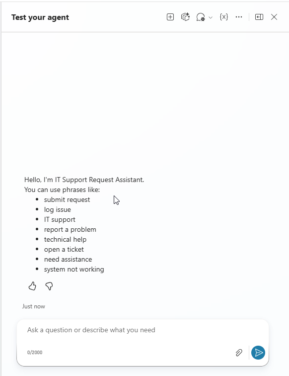
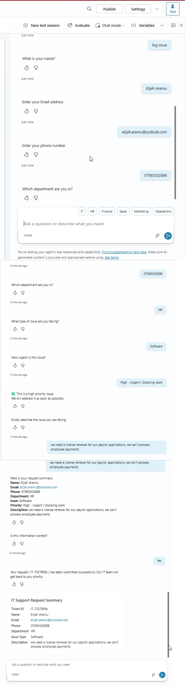
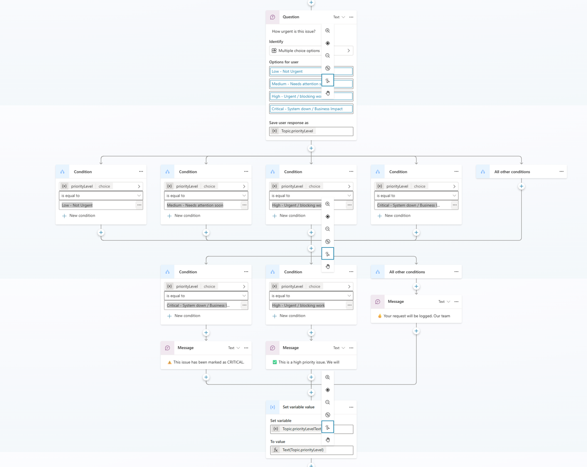
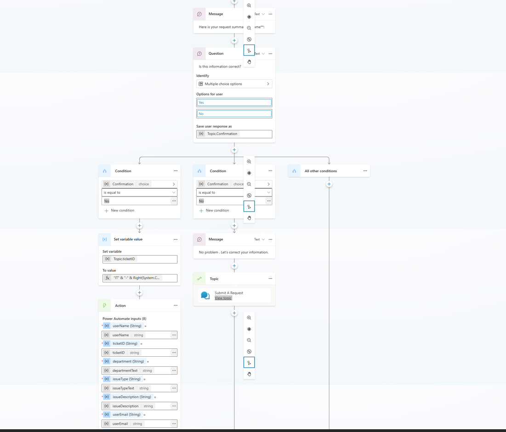
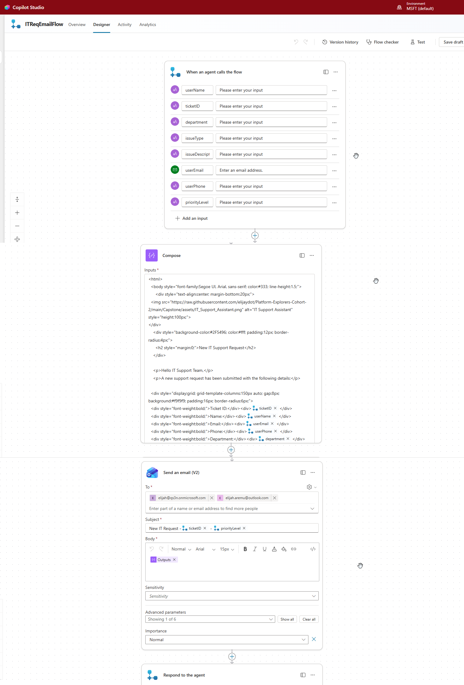
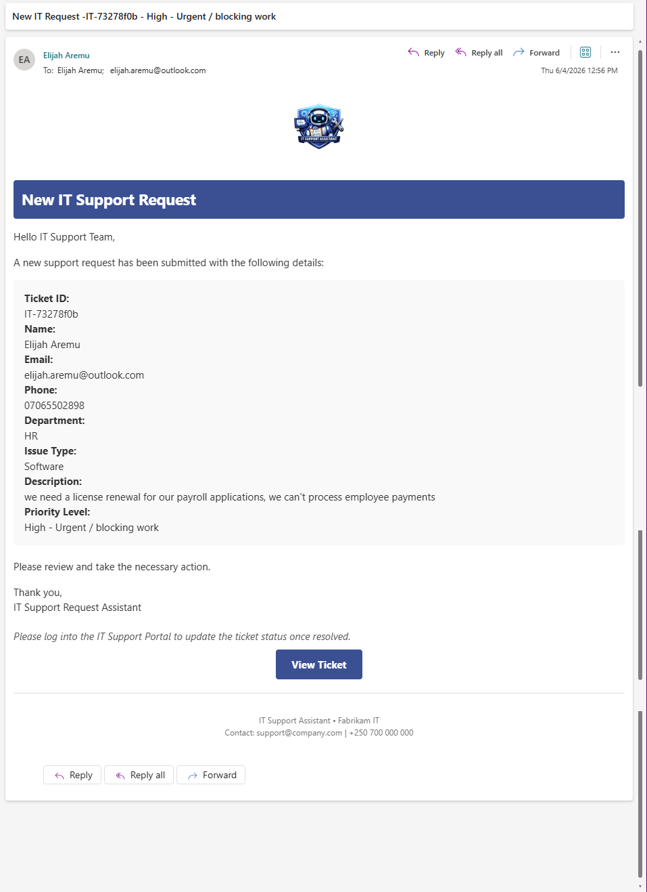

# Our Solution: IT Support Request Assistant

## Overview

To address inefficient IT request handling, we designed and implemented an intelligent conversational agent using Microsoft Copilot Studio, integrated with Power Automate.

The solution provides a guided, structured, and automated process for submitting IT support requests.

<p align="center">
  
</p>

## Core Concept

The assistant simulates a real-world IT helpdesk process by:
- Collecting structured user input
- Applying intelligent decision logic
- Generating a unique ticket ID
- Automatically sending formatted requests by email

## Solution Architecture

### Core Components

- Copilot Studio topics:
  - Submit a Request (main workflow)
  - Start Over (reset logic)
  - Conversation Start (entry point)
- Power Automate flow:
  - ITReqEmailFlow (email delivery)

## End-to-End Process

### 1. Conversation Start
The user is welcomed with a guided starter message.

Example phrases shown in the implementation:
- submit request
- log issue
- IT support
- report a problem
- technical help
- open a ticket
- need assistance
- system not working



### 2. Submit a Request
The assistant collects structured data in sequence:
- User name
- Department (choice, then normalized to text)
- Issue type (choice, then normalized to text)
- Priority level (choice, then normalized to text)
- Issue description

Variables used in the implemented flow:
- userName
- userEmail
- userPhone
- department and departmentText
- issueType and issueTypeText
- priorityLevel and priorityText
- issueDescription
- ticketID
- Confirm (used in Start Over logic)



### 3. Priority-Based Logic
The system evaluates priority and responds dynamically:
- Critical: immediate escalation message
- High: urgent handling message
- Medium or Low: standard acknowledgement



### 4. Data Summary and Confirmation
Before submission, the assistant displays a structured summary:

```text
Name: {userName}
Email: {userEmail}
Phone: {userPhone}
Department: {departmentText}
Issue: {issueTypeText}
Priority: {priorityText}
Description: {issueDescription}
```

The user confirms the details before continuing.



### 5. Ticket Generation
A dynamic ticket ID is generated in this format:

```text
IT-XXXXXXXX
```

Formula used:

```text
"IT" & "-" & Right(System.Conversation.Id, 8)
```

### 6. Automated Email Submission
The assistant calls the ITReqEmailFlow in Power Automate to:
- Receive request inputs from Copilot Studio
- Include userEmail in the flow payload
- Build a formatted HTML request body in Compose
- Send the email through Outlook
- Return a success response back to the agent





### 7. Restart Capability
Users can restart the conversation through the Start Over topic.

Implemented behavior:
- The topic asks for restart confirmation (Boolean)
- If true, it routes to Reset Conversation
- If false, it continues with a carry-on message


## Key Features

- Guided conversational user experience
- Structured data capture
- Intelligent priority handling
- Ticket ID generation
- Power Automate integration
- HTML email formatting
- Restart functionality

## Testing

The solution was tested using multiple scenarios:

| Scenario | Result |
| --- | --- |
| Standard request | Success |
| Critical issue | Escalation triggered |
| Incorrect input | Handled |
| Restart flow | Works correctly |

## Impact

This solution delivers:
- Faster IT request processing
- Improved data accuracy
- Better prioritization
- Reduced manual effort

This demonstrates a real-world implementation of a modern conversational IT helpdesk.